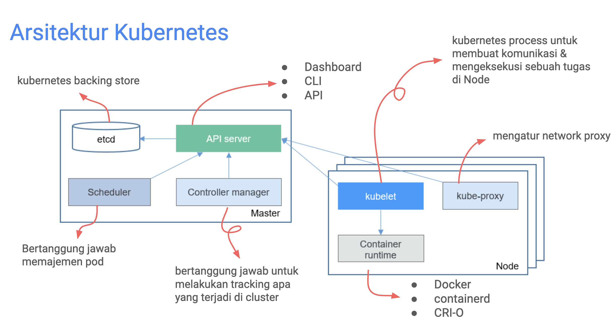
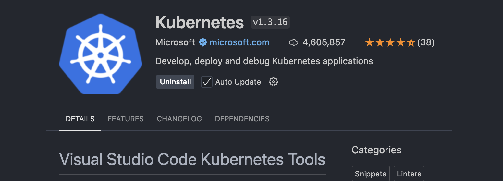
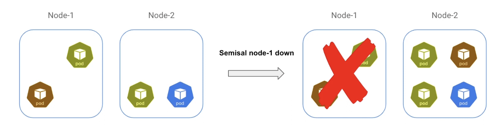
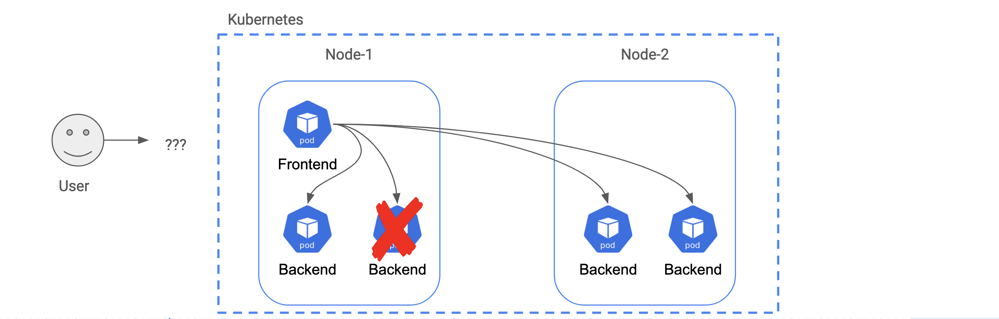
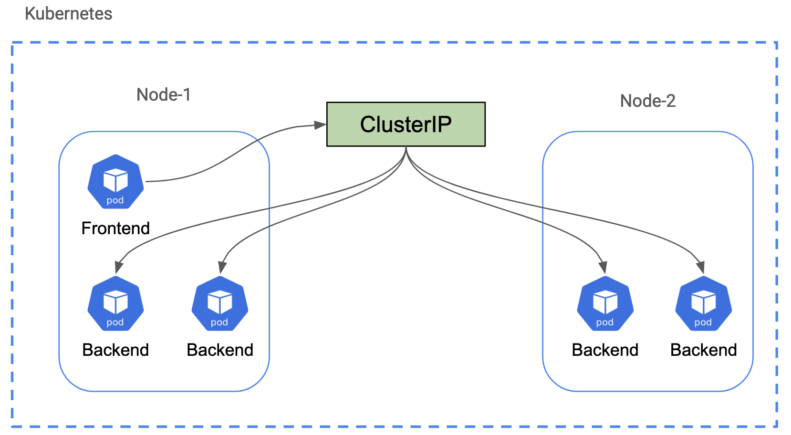
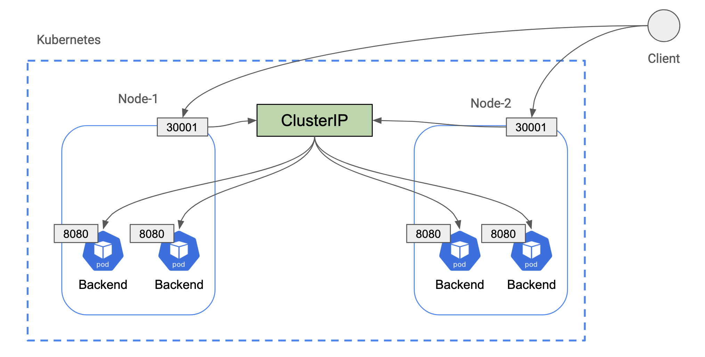
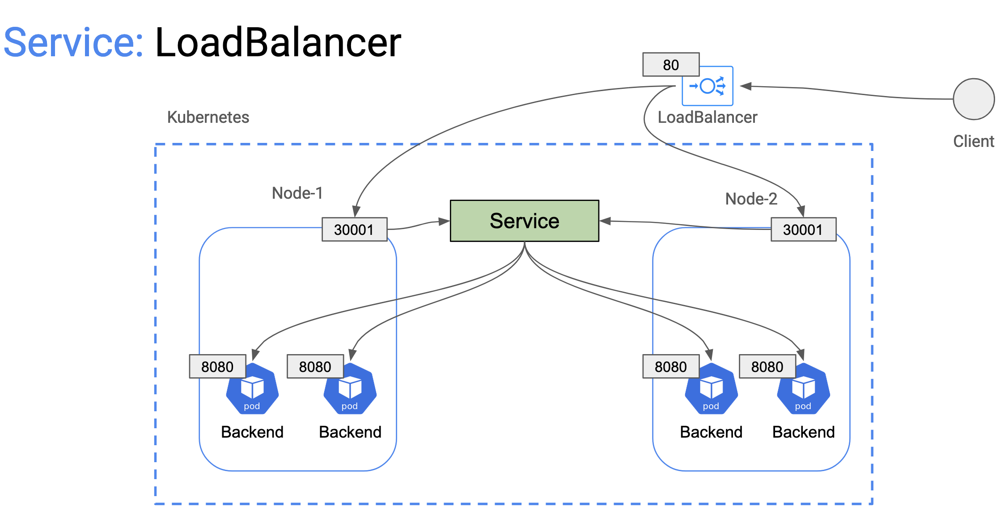
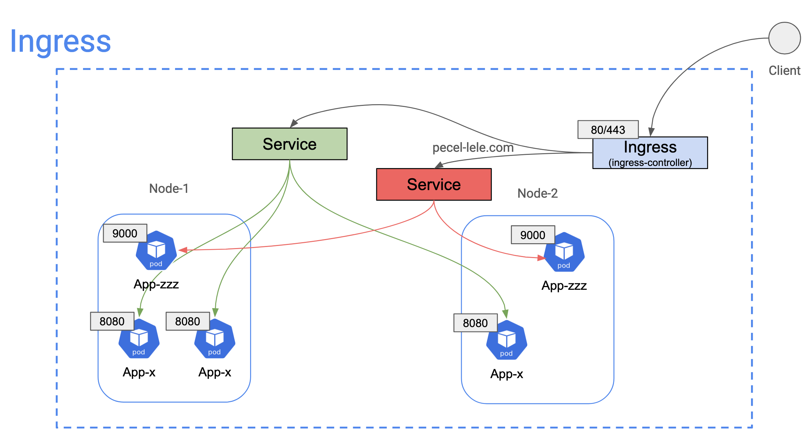

# Kubernetes Lab

Referensi dari kang `Rahardian`: https://www.youtube.com/watch?v=7zInpQfPRqo

## Pengenalan

Alkisah kenapa ada makhluk dengan nama `kubernetes` atau `k8s` pembuatnya sebut saja `Google` memiliki pengalaman bagaimana mereka memanage ratusan atau ribuan server.

Product google yang kita tahu sampai saat ini diakses oleh orang diseluruh dunia dan bagaiaman performanya yang stabil.

Kembali ke `Kubernetes`. Kubernetes ini sendiri adalah _open-source orchestration tool_ untuk memanage container. Biasanya untuk skala aplikasi yang sudah cukup besar keatas.

[SIMULASI]


Kubernetes bisa menjamin no downtime untuk aplikasi kita, atau paling tidak minim downtime.

Kubernetes semakin terkenal seiring banyaknya adopsi container & microservices.

#### **Pertanyaan?????** Lantas yang aplikasi kecil apakah boleh menggunakan `Kubernetes` ?

Aplikasi kecil tentu boleh menggunakan Kubernetes, namun ada beberapa hal yang perlu dipertimbangkan sebelum memutuskan apakah Kubernetes merupakan solusi yang tepat:

1. **Kompleksitas**: Kubernetes adalah alat yang kuat, namun bisa lebih kompleks dibandingkan solusi yang lebih sederhana seperti Docker Compose. Untuk aplikasi kecil, mungkin lebih banyak usaha yang dibutuhkan untuk mengatur dan memelihara Kubernetes dibandingkan manfaat yang didapatkan.
2. **Overhead**: Kubernetes membutuhkan sumber daya tambahan untuk menjalankan control plane, node, dan networking, yang bisa menjadi berlebihan untuk aplikasi kecil yang hanya butuh beberapa container.
3. **Skalabilitas**: Meski aplikasi kecil saat ini, jika rencananya aplikasi akan tumbuh dan berkembang pesat, menggunakan Kubernetes bisa memberikan keunggulan dari sisi otomatisasi, skalabilitas, dan reliabilitas yang dibutuhkan di masa depan.
4. **Operational** cost: Mengelola Kubernetes membutuhkan waktu dan biaya operasional lebih tinggi, baik dari sisi infrastruktur maupun tim yang memeliharanya. Aplikasi kecil yang tidak memerlukan skala tinggi mungkin lebih hemat menggunakan solusi yang lebih sederhana.

Jadi, jawabannya tergantung pada kebutuhan jangka panjang aplikasi. Jika aplikasi kecil tidak memerlukan banyak container atau skala besar, Kubernetes mungkin terasa overkill. Tapi jika ada rencana jangka panjang untuk penskalaan, Kubernetes bisa menjadi investasi yang baik.

_ssssttt jawaban diatas adalah dari ChatGPT ya ..... :XD_

Tapi intinya benar sesuaikan dengan kebutuhan yang diperlukan dan tentu uang hahaha.

[SIMULASI Lagi]


## Arsitektur Kubernetes



_terimakasih untuk mas **Dian**_ untuk materi dan gambarnya. Sumber asli disini ya [Materi Mas Dian](https://docs.google.com/presentation/d/15cPaGS_nRWF1iK2RRfrvudlN7mYQJBL5eX0g8CI45iM/edit#slide=id.p)

Bahas detail di bawah YGY :XD

### Master

Bagian Master bertugas sebagai pengontrol utama yang mengatur seluruh `Node` dalam cluster Kubernetes. Master memiliki beberapa komponen yang bekerja bersama untuk mengelola dan mengatur aplikasi dalam bentuk container.

#### ETCD

Komponen pertama adalah `etcd`, yang bisa dianggap sebagai "jantung" dari Kubernetes. `etcd` ini adalah tempat semua informasi penting tentang cluster disimpan. Ini seperti `database` untuk Kubernetes, yang menyimpan semua konfigurasi dan status aplikasi serta node di dalam cluster. Jika ada perubahan, `etcd` akan mencatatnya, sehingga sistem selalu tahu apa yang sedang terjadi.

#### API Server

Komponen kedua adalah `API Server`, yaitu pintu utama untuk berkomunikasi dengan Kubernetes. Semua perintah dan komunikasi ke cluster Kubernetes melewati API Server. Kita bisa berinteraksi dengan Kubernetes melalui:

- **Dashboard**: Antarmuka berbasis web.
- **CLI (Command Line Interface)**: Seperti kubectl untuk menjalankan perintah.
- **API**: Bisa digunakan oleh program lain untuk mengontrol cluster secara otomatis.

API Server menerima perintah, seperti meminta membuat pod atau mengubah konfigurasi, dan memberitahukan komponen lainnya untuk menjalankan tugas itu.

#### Scheduler

Komponen ketiga adalah `Scheduler`, adalah otak yang bertanggung jawab untuk memutuskan di mana sebuah pod (unit container yang menjalankan aplikasi) akan ditempatkan di dalam `cluster`. Scheduler melihat kapasitas setiap `node`, seperti penggunaan CPU dan memori, dan memilih `node` terbaik untuk menjalankan pod tersebut.

#### Controller Manager

Komponen keempat adalah `Controller Manager`, adalah pengatur utama yang bertugas memastikan `cluster Kubernetes` berjalan seperti yang diinginkan. Misalnya, jika ada pod yang mati, `Controller` Manager bertanggung jawab untuk membuat pod baru agar aplikasi tetap berjalan.

### Node

`Node` adalah komputer atau mesin tempat container aplikasi sebenarnya dijalankan. Setiap node memiliki beberapa komponen penting yang membantu menjalankan dan memonitor aplikasi.

#### Container Runtime

`Container Runtime` adalah mesin yang benar-benar menjalankan `container`, seperti `Docker`, `containerd`, atau `CRI-O`. Container runtime inilah yang menjalankan container aplikasi yang dimasukkan ke dalam pod. Kubernetes bekerja dengan berbagai container runtime, dan inilah yang memungkinkan aplikasi untuk berjalan di dalam container.

#### Kubelet

`Kubelet` adalah agen yang berjalan di setiap node. Tugas Kubelet adalah memastikan bahwa semua pod yang dijadwalkan oleh scheduler berjalan dengan baik di node tersebut. Kubelet memeriksa pod secara rutin dan melaporkan statusnya kembali ke `API Server`. Jika ada masalah, seperti pod yang gagal dijalankan, Kubelet akan mencoba memperbaikinya atau memberi tahu master.

#### Kube-Proxy

`Kube-Proxy` bertanggung jawab mengatur lalu lintas jaringan di dalam cluster. Kube-Proxy memastikan bahwa pod-pod di dalam cluster bisa berkomunikasi satu sama lain, baik di dalam node yang sama atau antar node. Selain itu, Kube-Proxy juga membantu mengatur lalu lintas dari luar cluster menuju pod.

### Kubernetes Master-Node

| Worker Node 1     | Worker Node 2     | Worker Node 3     |
| ----------------- | ----------------- | ----------------- |
| Kubelet           | Kubelet           | Kubelet           |
| Kube-Proxy        | Kube-Proxy        | Kube-Proxy        |
| Container Runtime | Container Runtime | Container Runtime |
| Pods              | Pods              | Pods              |

### POD

`Pod` adalah unit terkecil di kubernetes, dimana dalam 1 pod bisa lebih dari 1 `container`. 1 Pod memiliki satu IP Address dan Pod bersifat ephemeral. Ephemeral itu sendiri adalah tidak kekal dapat di buat ulang oleh kubernetes.

Beberapa command dalam `pod`:

_Membuat resource di kubernetes_

```bash
kubectl apply -f {file_name}
```

_Melihat semua pod_

```bash
kubectl get pod
```

_Melihat detail pod_

```bash
kubectl describe pod {pod_name}
```

_Melakukan port-forward dari pod_

```bash
kubectl port-forward pod/{pod_name} {port_local:port_pod}
```

## Minikube

Pada praktik ini kita menggunakan `minikube`. Lebih detail tentang minikube dapat di cek di url berikut https://minikube.sigs.k8s.io/docs/

Ikuti langkah-langkah instalasi di web tersebut ya, sudah cukup jelas kok dokumentasinya jadi gak perlu di tulis disini hhi :XD.

Jika sudah install kita bisa memulai `minikube` dengan perintah:

```bash
minikube start
```

Jika berhasil akan keluar seperti berikut:

```bash
➜  ~ minikube start
😄  minikube v1.33.1 on Darwin 14.6.1
🆕  Kubernetes 1.30.0 is now available. If you would like to upgrade, specify: --kubernetes-version=v1.30.0
✨  Using the docker driver based on existing profile
👍  Starting "minikube" primary control-plane node in "minikube" cluster
🚜  Pulling base image v0.0.44 ...
🔄  Restarting existing docker container for "minikube" ...
```

Tunggu hingga proses selesai ya. Kalo sudah akan muncul informasi berikut:

```bash
...
🏄  Done! kubectl is now configured to use "minikube" cluster and "default" namespace by default
```

Karena `minikube` berjalan menggunakan `docker` kita bisa cek dia dengan menggunakan perintah `docker ps -a` untuk melihat bahwa `minikube` akan membuat 1 buah container yang berjalan.

**Note**

Tool `minikube` ini sebagai bahan untuk belajar ya, dan `minikube` ini didesain semirip mungkin dengan `kubernetes` asli.

## Kubectl

Berikutnya yang tidak kalah penting kamu juga di harapkan sudah menginstall `kubectl`. Untuk informaso dan instalasi bisa kunjungi url berikut https://kubernetes.io/docs/tasks/tools/ sesuaikan dengan sistem operasi yang kamu miliki ya.

Jika sudah install kamu bisa cek menggunakan `kubectl version` yang jika sudah diinstall akan keluar informasi berikut:

```bash
Client Version: v1.30.2
Kustomize Version: v5.0.4-0.20230601165947-6ce0bf390ce3
Server Version: v1.26.1
WARNING: version difference between client (1.30) and server (1.26) exceeds the supported minor version skew of +/-1
```

## Membuat Pod

Sebelum lanjut pastikan kamu sudah menginstall ekstensi `kubernetes` berikut ekstensi nya:


Jika sudah silahkan buat 1 buah file baru contoh disini kita akan membuat dengan nama `pod.yaml`, karena kita sudah menginstall ekstensi kubernetes kamu tidak perlu menulis 1 persatu cukup ketik `pod` kemudian `tab`, maka akan muncul template pod yang dibuat seperti berikut:

```yaml
apiVersion: v1
kind: Pod
metadata:
  name: myapp
  labels:
    name: myapp
spec:
  containers:
    - name: myapp
      image: <Image>
      resources:
        limits:
          memory: '128Mi'
          cpu: '500m'
      ports:
        - containerPort: <Port>
```

Tidak perlu di hapal ya isian di atas. Jika sudah belajar `docker` hal di atas tidak akan asing lagi.

Praktik disini misalnya kita akan membuat pod yang mempunyai container `nginx`:

```yaml
apiVersion: v1
kind: Pod
metadata:
  name: sample-nginx
  labels:
    name: sample-nginx
spec:
  containers:
    - name: sample-nginx
      image: nginx:alpine
      resources:
        limits:
          memory: '10Mi'
          cpu: '10m'
      ports:
        - containerPort: 80
```

Berikutnya untuk membuat `pod` yang sudah didefinisikan di atas gunakan beberapa perintah yang sudah di jelaskan sebelumnya di section [POD](#pod).

Jadi perintahnya seperti ini ya (_file `pod.yaml` pada praktik ini berada di folder `sample`_):

```bash
kubectl apply -f sample/pod.yaml
```

Jika berhasil akan muncul informasi berikut:

```bash
pod/sample-nginx created
```

Kemudian cek pod nya dengan perintah berikut:

```bash
kubectl get pod

NAME           READY   STATUS               RESTARTS   AGE
sample-nginx   0/1     ContainerCreating    0          89s
```

Fokus pada `STATUS`, berikut adalah beberapa status umum yang bisa muncul:

- `ContainerCreating`: Kubernetes sedang mempersiapkan container untuk pod tersebut. Proses ini termasuk menarik image yang diperlukan (seperti `nginx:alpine`), membuat container, dan menghubungkannya dengan jaringan cluster. Jika pod tetap berada dalam status ini terlalu lama, mungkin ada masalah dalam mengunduh image atau menjalankan container.
- `Running`: Pod sudah berjalan dan container di dalamnya aktif. Status ini menandakan bahwa semuanya berjalan normal.
- `Pending`: Pod belum siap untuk dijalankan karena salah satu langkah persiapan (seperti scheduling atau penarikan image) belum selesai. Ini biasanya terjadi jika ada masalah dengan scheduling pod ke node.
- `Succeeded`: Pod telah selesai dengan sukses, biasanya digunakan untuk pod dengan job atau cronjob yang selesai menjalankan tugasnya.
- `Failed`: Pod gagal dijalankan. Penyebabnya bisa bermacam-macam, seperti kesalahan konfigurasi atau masalah dengan container itu sendiri.
- `CrashLoopBackOff`: Pod terus-menerus gagal dimulai dan Kubernetes mencoba untuk me-restart container tersebut. Ini menandakan bahwa container mengalami masalah setiap kali mencoba dijalankan.

Berikutnya kita bisa cek secara detail container yang terbuat dengan cara:

```bash
kubectl describe pod sample-nginx
```

Setelah `[enter]` akan muncul beberapa informasi detail dari container.

Berikutnya kita akan coba melakukan `port-forwarding` yang mana ini harusnya sudah di ajarkan di materi `docker`.

```bash
kubectl port-forward pod/sample-nginx 8080:80

Forwarding from 127.0.0.1:8080 -> 80
Forwarding from [::1]:8080 -> 80
```

Silahkan buka pada browser untuk akses `nginx` karena sudah kita lakukan `port-forward` maka aksesnya bukan lagi ke port `:80` tapi ke port `:8080` jika ditulis lengkap di url adalah sebagai berikut `localhost:8080` dan hasilnya adalah sebagai berikut:


## Kubectl Exec

Kembali ke materi `docker` dahulu ya, pada docker kita bisa masuk kedalam container yang berjalan dengan perintah `docker exec`, hal ini juga sama pada `pod` di kubernetes kita bisa masuk ke dalam container dengan perintah `kubectl exec`.

**Catatan**: Dalam `pod` bisa lebih dari satu container maka untuk masuk ke dalam container nya tandai dengan flag atau option `-c {nama_container}`. Perintah lengkapnya adalah sebagai berikut:

```bash
kubectl exec -it {nama_pod} -c {nama_container} -- /bin/sh
```

Jadi jika ingin masuk ke container yang sudah terbuat sebelumnya adalah sebagai berikut:

```bash
kubectl exec -it sample-nginx -- /bin/sh

/ # ls
bin                   home                  proc                  sys
dev                   lib                   root                  tmp
docker-entrypoint.d   media                 run                   usr
docker-entrypoint.sh  mnt                   sbin                  var
etc                   opt                   srv
/ #
```

## Kubernetes Node

### Pengantar

Node adalah mesin (fisik atau virtual) di Kubernetes yang menjalankan pod. Setiap node memiliki tiga komponen utama:

- `Kubelet`: Agen di node yang menjalankan pod berdasarkan instruksi dari API Server dan memastikan container berjalan sesuai kebutuhan.
- `Kube-Proxy`: Mengatur jaringan antar pod dan node, memungkinkan komunikasi internal dan eksternal di cluster.
- `Container Runtime`: Software yang mengeksekusi container di dalam pod, seperti Docker, Containerd, atau CRI-O.

Proses Kerja Node:

- `Kubelet` menjalankan pod.
- `Kube-Proxy` mengelola komunikasi antar pod.
- `Container` Runtime menjalankan container di pod.

Node adalah fondasi eksekusi aplikasi dalam cluster Kubernetes. Node dapat dikelompokkan dengan `node-pool (cloud)`. Node Pool adalah kumpulan node dalam cluster Kubernetes dengan konfigurasi khusus (CPU tinggi, memori besar, GPU, dll.), digunakan untuk mengelola resource sesuai kebutuhan aplikasi.

**Penggunaan Node Pool:**

- `Cloud`: Umumnya digunakan di cloud (seperti `GKE`, `EKS`, `AKS`) untuk autoscaling, isolasi workload, dan optimasi biaya.
- `Local`: Jarang digunakan karena biasanya node lokal terbatas dan tidak memerlukan pembagian pool.

Jadi, Node Pool lebih sering digunakan di cloud untuk pengelolaan skala besar.

[SIMULASI]


### Perintah Dalam Node

Beberapa perintah yang dapat di lakukan dalam `node`:

_Melihat semua node_

```bash
kubectl get node

kubectl get node -o wide
```

_Melihat detail node_

```bash
kubectl describe node {node_name}
```

Mari kita praktik tentang `node`, pertama kita akan melihat `node` yang tersedia.

```bash
kubectl get node
```

Perintah di atas akan mengeluarkan informasi berikut:

```bash
NAME       STATUS   ROLES           AGE   VERSION
minikube   Ready    control-plane   12d   v1.26.1
```

Atau bisa menggunakan perintah:

```bash
kubectl get node -o wide
```

Informasi yang dihasilkan adalah sebagai berikut:

```bash
NAME       STATUS   ROLES           AGE   VERSION   INTERNAL-IP    EXTERNAL-IP   OS-IMAGE             KERNEL-VERSION    CONTAINER-RUNTIME
minikube   Ready    control-plane   12d   v1.26.1   192.168.49.2   <none>        Ubuntu 20.04.5 LTS   6.10.4-linuxkit   docker://20.10.23
```

Terakhir kita juga bisa melihat lebih detail lagi dengan perintah:

```bash
kubectl describe node minikube
```

Akan ada informasi yang detail.

**Catatan**

Node yang tersedia adalah `minikube` karena di local dan memang di local pasti hanya itu yang tersedia, beda cerita kalo kita sudah menggunakan `cloud` yang sudah dijelaskan sebelumnya. Sebenarnya ada versi local selain `minikube` yaitu `kind` atau `kubernetes in docker`. Lebih detail tentang `kind` cek di url berikut https://kind.sigs.k8s.io/.

## Kubernetes Namespace

### Pengantar

Namespace di Kubernetes digunakan untuk mengelompokkan resource. Pada namespace yang dibuat dia tidak mengisolasi resource dan `pod` di beda namespace tetap bisa saling berkomunikasi.

Biasanya namespace akan mengelompokkan sebuah `pod`.

**Namespace default di Kubernetes meliputi:**

- `default`: Tempat resource dibuat jika tidak ada namespace yang ditentukan.
- `kube-system`: Untuk komponen internal Kubernetes.
- `kube-public`: Akses publik untuk data tertentu.

Atau bisa mengguanakan nama lain seperti `backend`, `frontend` dan seterusnya.

### Perintah Dalam Namespace

Berikut adalah beberapa perintah dasar yang sering digunakan untuk bekerja dengan namespace di Kubernetes:

_Melihat Namespace yang Ada:_

```bash
kubectl get ns

kubectl get namespaces
```

_Membuat Namespace Baru:_

```bash
kubectl create namespace {nama_namespace}
```

_Menghapus Namespace:_

```bash
kubectl delete namespace {nama_namespace}
```

_Menjalankan Pod di Namespace Tertentu:_

```bash
kubectl run {nama_pod} --image={nama_image} -n {nama_namespace}
```

_Melihat Pod dalam Namespace Tertentu:_

```bash
kubectl get pods -n {nama_namespace}
```

_Menggunakan Namespace Secara Default untuk Setiap Perintah:_

```bash
kubectl config set-context --current --namespace={nama_namespace}
```

Kita coba cek dahulu `namespace` yang tersedia dengan perintah:

```bash
kubectl get ns
```

Hasilnya adalah sebagai berikut:

```bash
NAME                   STATUS   AGE
default                Active   12d
kube-node-lease        Active   12d
kube-public            Active   12d
kube-system            Active   12d
kubernetes-dashboard   Active   12d
```

Lantas dimana letak pod kita ? jawabannya ada di namespace `default`. Mari kita cek caranya bisa seperti berikut:

```bash
kubectl describe pod sample-nginx

Name:             sample-nginx
Namespace:        default
...
```

Terlihat bahwa saat ini `sample-nginx` berada di namespace `default`.

Atau bisa juga melalui namespace nya:

```bash
kubectl get pods -n default
```

Berikutnya kita akan coba untuk membuat sebuah `namespace`:

```bash
kubectl create ns backend
```

Hasilnya adalah sebagai berikut:

```bash
kubectl create ns backend
namespace/backend created
```

Cek lagi untuk melihat namespace:

```bash
kubectl get ns
NAME                   STATUS   AGE
backend                Active   41s
default                Active   12d
kube-node-lease        Active   12d
kube-public            Active   12d
kube-system            Active   12d
kubernetes-dashboard   Active   12d
```

Namespace `backend` sudah tersedia ya. sekarang coba kita buat pod yang akan diarahkan ke dalam ns `backend` ya. Kita buka file `pod.yaml` kemudian saya buat duplicate dari file berikut dengan nama `pod_ns.yaml` isinya adalah sebagai berikut:

```yaml
apiVersion: v1
kind: Pod
metadata:
  name: sample-nginx-new
  labels:
    name: sample-nginx-new
  namespace: backend
spec:
  containers:
    - name: sample-nginx-new
      image: nginx:alpine
      resources:
        limits:
          memory: '10Mi'
          cpu: '10m'
      ports:
        - containerPort: 80
```

Setelah itu lakukan `apply` dengan cara:

```bash
kubectl apply -f sample/pod_ns.yaml
```

Kemudian kita cek pod nya dengan perintah `kubectl get pod` yang terjadi adalah sebagai berikut:

```bash
kubectl get pod
NAME           READY   STATUS    RESTARTS   AGE
sample-nginx   1/1     Running   0          3h16m
```

Pod yang terbaru dengan nama `sample-nginx-new` tidak ditemukan. Lalu bagaimana agar itu juga muncul?????

Secara default ketika kita menggunakan perintah `kubectl get pod` yang akan tampil adalah namespace `default`.

Gunakan cara ini ya:

```bash
kubectl config set-context --current --namespace backend
```

Cara di atas adalah kita melakukan pindah `namespace` dari `default` kedalam namespace `backend`. Sekarang kita coba cek lagi menggunakan `kubectl get pod` hasilnya akan sebagai berikut:

```bash
kubectl get pod
NAME               READY   STATUS    RESTARTS   AGE
sample-nginx-new   1/1     Running   0          5m27s
```

Bagaimana jika ingin melihat semua pod walau di berbagai namespace???

Caranya adalah sebagai berikut:

```bash
kubectl get pods --all-namespaces
```

Hasilnya adalah sebagai berikut:

```bash
NAMESPACE              NAME                                        READY   STATUS    RESTARTS       AGE
backend                sample-nginx-new                            1/1     Running   0              8m8s
default                sample-nginx                                1/1     Running   0              3h21m
kube-system            coredns-787d4945fb-8tscg                    1/1     Running   1 (12d ago)    12d
...
```

## Label & Annotations

### Pengantar

Label dan Annotations adalah metadata yang digunakan untuk mengelola dan mengidentifikasi resource di Kubernetes.

### Label

Label adalah `key-value` pair yang melekat pada resource (seperti `pod`, `service`, dll) dan digunakan untuk pengelompokan dan seleksi resource.

Beberapa perintah yang dapat digunakan adalah:

_Mencari pod berdasarkan label:_

```bash
kubectl get pod -l key

kubectl get pod -l key=value

kubectl get pod -l key!=value
```

Dari file `pod.yaml` dan `pod_ns.yaml` yang kita buat sebenarnya sudah memberikan sebuah labels. Label yang diberikan adalah `name`:

```yaml
apiVersion: v1
kind: Pod
metadata:
  name: sample-nginx-new
  labels:
    name: sample-nginx-new
  namespace: backend
```

Kita bisa memberikan label tambahan seperti `stack`, `version` dan apapun itu, karena label hanya sebagai pengelompokkan untuk tiap `pod`.

Beda apa dengan `namespace` yang sama-sama pengelompokkan ?

**Perbedaan utama antara Label dan Namespace dalam Kubernetes:**

- `Namespace`: Digunakan untuk membagi resource secara logis dalam satu cluster, seperti mengisolasi lingkungan (misalnya, development, testing, production). Namespace lebih bersifat global dan digunakan untuk memisahkan resource secara keseluruhan.
- `Label`: Digunakan untuk mengelompokkan resource dalam satu namespace atau antar namespace. Dengan label, Anda bisa mengidentifikasi, memilih, atau memfilter resource tertentu berdasarkan atribut seperti stack, version, dll.

**Kesimpulan:**

- `Namespace`: Untuk pembagian besar atau isolasi lingkungan.
- `Label`: Untuk pengelompokkan lebih granular pada resource tertentu dalam atau antar namespace.

Kita akan coba tambahkan label pada pod yang sudah dibuat, buka salah satu kemudian tambahkan label sebagai berikut:

```yaml
apiVersion: v1
kind: Pod
metadata:
  name: sample-nginx-new
  labels:
    name: sample-nginx-new
    stack: frontend
    version: 1.1.0
  namespace: backend
spec:
  containers:
    - name: sample-nginx-new
      image: nginx:alpine
      resources:
        limits:
          memory: '10Mi'
          cpu: '10m'
      ports:
        - containerPort: 80
```

Kemudian kita update pod dengan perintah berikut:

```bash
kubectl apply -f sample/pod_ns.yaml
```

Jika berhasil akan menampilkan informasi berikut:

```bash
pod/sample-nginx-new configured
```

Kemudian kita bisa mencari berdasarkan label dengan perintah berikut:

```bash
kubectl get pod -l stack=frontend
```

Hasilnya adalah sebagai berikut:

```bash
NAME               READY   STATUS    RESTARTS   AGE
sample-nginx-new   1/1     Running   0          67m
```

### Annotation

Annotation adalah `metadata` tambahan yang disematkan pada resource Kubernetes. Berbeda dengan label, annotations tidak digunakan untuk pengelompokan atau seleksi resource. Sebaliknya, annotations digunakan untuk menyimpan informasi atau deskripsi tambahan yang tidak mempengaruhi operasi Kubernetes.

Penggunaan:

```yaml
apiVersion: v1
kind: Pod
metadata:
  name: sample-nginx-new
  labels:
    name: sample-nginx-new
    stack: frontend
    version: 1.1.0
  annotations:
    description: 'Pod ini untuk server frontend'
    owner: 'team@enigmacamp.com'
    version: 'v1.0'
```

Kemudian lakukan perintah berikut untuk mengupdate:

```bash
kubectl apply -f sample/pod_ns.yaml
```

Cek informasi perubahan dengan perintah berikut:

```bash
kubectl describe pod sample-nginx-new
Name:             sample-nginx-new
Namespace:        backend
Priority:         0
Service Account:  default
Node:             minikube/192.168.49.2
Start Time:       Thu, 12 Sep 2024 09:18:18 +0700
Labels:           name=sample-nginx-new
                  stack=frontend
                  version=1.1.0
Annotations:      description: Pod ini untuk server frontend
                  owner: team@enigmacamp.com
                  version: v1.0
```

## Menghapus Resource

Kita dapat menghapus `resource` langsung dari command, namun secara best-practice kita dianjurkan menghapus resource dengan menggunakan file `.yaml` resource tersebut.

Perintah-perintah yang dapat dilakukan adalah sebagai berikut:

_Melihat semua resource:_

```bash
kubectl get all
```

_Menghapus resource:_

```bash
kubectl delete pod {pod_name}

kubectl delete namespace {ns_name}
```

_Menghapus menggunakan `.yaml` file (direkomendasikan):_

```bash
kubectl delete -f {file_name}
```

## ReplicaSet

ReplicaSet adalah komponen Kubernetes yang memastikan jumlah replika (salinan) dari sebuah Pod tetap konsisten. Jika sebuah pod gagal atau dihentikan, ReplicaSet secara otomatis membuat pod baru untuk menjaga jumlah replika yang diinginkan.

[SIMULASI]



**Element yang ada di `ReplicaSet`:**

- `Label Selector`: untuk mengetahui pod mana yang harus dimanage
- `Replica Count`: untuk mengatur jumlah pod yang berjalan
- `Pod Template`: untuk konfigurasi pod

Berikut beberapa perintah yang bisa dilakukan:

_Melihat semua replicaSet:_

```bash
kubectl get rs

kubectl get replicasets
```

_Melihat detail replica set:_

```bash
kubectl describe replicates {name}
```

Baik sekarag kita buat `replicaSet` nya ya. Pada hand on ini dibuat file dengan nama `replicaSet.yaml` di simpan dalam folder `sample`.

```yaml
# Referensi untuk template https://kubernetes.io/id/docs/concepts/workloads/controllers/replicaset
apiVersion: apps/v1
kind: ReplicaSet
metadata:
  name: sample-nginx-new
spec:
  # modify replicas according to your case
  replicas: 3
  selector:
    matchLabels:
      app: sample-nginx-new
  template:
    metadata:
      name: sample-nginx-new
      labels:
        app: sample-nginx-new
    spec:
      containers:
        - name: sample-nginx-new
          image: nginx:alpine
          resources:
            limits:
              memory: '10Mi'
              cpu: '10m'
          ports:
            - containerPort: 80
```

Berikut adalah penjelasan detail dari konfigurasi ReplicaSet:

```yaml
apiVersion: apps/v1
kind: ReplicaSet
metadata:
  name: sample-nginx-new
```

- `apiVersion`: `apps/v1`: Menentukan versi API Kubernetes yang digunakan, yaitu apps/v1, yang diperlukan untuk mendefinisikan ReplicaSet.
- `kind`: `ReplicaSet`: Menunjukkan bahwa resource yang didefinisikan adalah ReplicaSet, yaitu komponen yang memastikan jumlah replika pod tetap stabil.
- `metadata`: Bagian ini berisi informasi metadata tentang ReplicaSet, seperti `name` yang menyebut nama resource, yaitu `sample-nginx-new`.

```yaml
spec:
  replicas: 3
```

- `replicas`: `3`: Menentukan jumlah pod yang harus dijalankan oleh ReplicaSet. Dalam kasus ini, akan selalu ada tiga pod nginx yang aktif.

```yaml
selector:
  matchLabels:
    app: sample-nginx-new
```

- `selector`: Digunakan oleh ReplicaSet untuk menemukan dan mengelola pod yang cocok.
- `matchLabels` menyatakan bahwa pod yang memiliki label `app`: `sample-nginx-new` akan dikelola oleh ReplicaSet ini.

```yaml
template:
  metadata:
    name: sample-nginx-new
    labels:
      app: sample-nginx-new
```

- `template`: Ini adalah template yang digunakan untuk membuat pod baru. Pod baru akan dibuat jika jumlah replika kurang dari yang ditentukan (misalnya jika pod mati atau gagal).
- `metadata`: Menyertakan informasi seperti name dan labels.
  - `Label app`: `sample-nginx-new` digunakan agar pod yang dibuat dikenali dan dikelola oleh ReplicaSet berdasarkan selektor di atas.

```yaml
spec:
  containers:
    - name: sample-nginx-new
      image: nginx:alpine
```

- `spec`: Mendefinisikan spesifikasi pod, termasuk definisi container yang akan dijalankan.
- `containers`: Mendefinisikan satu atau lebih container di dalam pod.
  - `name`: `sample-nginx-new`: Nama container di dalam pod.
  - `image`: `nginx` : Image yang digunakan untuk container ini adalah `nginx:alpine`, versi ringan dari NGINX.

```yaml
resources:
  limits:
    memory: '10Mi'
    cpu: '10m'
```

- `resources`: Menentukan batasan resource untuk container.
  - `limits`: Menyatakan batas maksimum resource yang bisa digunakan oleh container.
  - `memory`: `'10Mi'`: Container dibatasi untuk menggunakan maksimal `10MiB` memory.
  - `cpu`: `'10m'`: Container dibatasi untuk menggunakan maksimal `10 millicores` CPU.

```yaml
ports:
  - containerPort: 80
```

- `ports`: Mendefinisikan port yang akan dibuka oleh container.
  - `containerPort`: `80`: Port 80 di dalam container akan dibuka, yang biasanya digunakan oleh aplikasi web (seperti NGINX).

Konfigurasi ini memastikan bahwa tiga pod nginx berjalan dengan batas resource yang ditentukan, dan jika salah satu pod gagal, ReplicaSet akan membuat pod baru untuk menjaga jumlah replika tetap tiga.

Jika sudah kita daftarkan resource nya dengan perintah:

```bash
kubectl apply -f sample/replicaSet.yaml
```

Kemudian cek `pod` maka akan menghasilkan sebagai berikut:

```bash
NAME                     READY   STATUS              RESTARTS   AGE
sample-nginx-new-8kmc8   0/1     ContainerCreating   0          6s
sample-nginx-new-tgg8n   0/1     ContainerCreating   0          6s
sample-nginx-new-zvjkg   0/1     ContainerCreating   0          6s
```

Akan tercipat name `sample-nginx-new-{random}` kemudian digit terakhir dibuat random.

Berikutnya kita akan mensimulasikan bagaimana `replicaSet` ini bekerja, disini coba kita hapus salah satu pod, misal sesuai tulisan ini (_akan berbeda dengan milik mu, jadi sesuaikan saja_) disini akan hapus pod dengan nama `sample-nginx-new-tgg8n` perintah yang dilakukan adalah:

```bash
kubectl delete pod sample-nginx-new-tgg8n
```

Tunggu hingga proses selesai, jika sudah lakukan cek menggunakan `kubectl get pod`.

Hasilnya adalah akan diciptakan pod baru secara otomatis:

```bash
NAME                     READY   STATUS    RESTARTS   AGE
sample-nginx-new-8kmc8   1/1     Running   0          68m
sample-nginx-new-xsndg   1/1     Running   0          30s
sample-nginx-new-zvjkg   1/1     Running   0          68m
```

Pod baru `sample-nginx-new-xsndg` tercipta secara otomatis.

## Deployment

Coba bayangkan bagaimana kita mengupdate versi aplikasi kita di kubernetes ?????


Jika kita menggunakan `pod` atau `replicaSet` secara langsung, kita perlu menghapus terlebih dahulu lalu membuat ulang dengan versi aplikasi yang baru.

Hal itu akan membuat downtime di aplikasi kita. Secara production ketika kita langsung hapus `pod` maka aplikasi yang berjalan di dalamnya pasti tidak bisa di akses dan akan terjadi downtime yang lama.

Deployment dapat mengatur ReplicaSet secara otomatis jika kita melakukan update atau rollback versi aplikasi. Secara default Deployment akan menggunakan metode `Rolling Update` agar aplikasi kita tidak downtime.

[SIMULASI]


Jadi.... daripada menggunakan `ReplicaSet`, lebih baik untuk menggunakan Deployment, karena Deployment mengabtraksi ReplicaSet.

**Element di dalam Replica Set:**

- `Strategy type`: defaultnya adalah Rolling Update untuk yang lain bisa cek disini ya https://kubernetes.io/docs/concepts/workloads/controllers/deployment/#strategy
- `Revision history limit`: adalah jumlah history revisi yang dilakukan, bentuknya tabel dengan nomor revisi dimulai dari `1`, `2`, dst...
- `ReplicaSet element`: karena `Deployement` adalah sebagai abstraksi dari `ReplicaSet` maka di dalam deployment kita bisa menggunakan konfigurasi dari ReplicaSet.

Beberapa perintah yang dapat dilakukan di Deployment.

_Melihat semua deployment:_

```bash
kubectl get deployment
```

_Melihat rollout status:_

```bash
kubectl rollout status deployment {name}
```

_Melihat history deployment:_

```bash
kubectl rollout history deployment {name}
```

_Melakukan rollback deployment:_

```bash
kubectl rollout undo deployment {pod_name} --to-revision={revision}
```

Buat file baru dengan nama `deployment.yaml` pada praktik ini file tersebut di simpan kedalam folder `sample`.

```yaml
apiVersion: apps/v1
kind: Deployment
metadata:
  name: sample-nginx-new
spec:
  selector:
    matchLabels:
      app: sample-nginx-new
  template:
    metadata:
      labels:
        app: sample-nginx-new
    spec:
      containers:
        - name: sample-nginx-new
          # contoh disini kita menggunakan versi awal
          image: nginx:1.27
          resources:
            limits:
              memory: '108Mi'
              cpu: '10m'
          ports:
            - containerPort: 80
```

Setelah itu kita lakukan `apply` dengan perintah:

```bash
kubectl apply -f sample/deployment.yaml
```

Setelah itu bisa cek proses pembuatan resource ya dengan perintah:

```bash
kubectl describe pod sample-nginx-new
```

Akan ada informasi yang mungkin akan berbeda seperti di bawah:

```bash
Events:
  Type    Reason     Age   From               Message
  ----    ------     ----  ----               -------
  Normal  Scheduled  2m1s  default-scheduler  Successfully assigned backend/sample-nginx-new-784486fd55-qm4jc to minikube
  Normal  Pulling    114s  kubelet            Pulling image "nginx:1.27"
  Normal  Pulled     44s   kubelet            Successfully pulled image "nginx:1.27" in 1m10.001447169s (1m10.001462292s including waiting)
  Normal  Created    43s   kubelet            Created container sample-nginx-new
  Normal  Started    40s   kubelet            Started container sample-nginx-new
```

Cek versi yang digunakan bisa demngan `describe` juga ya informasinya akan ditampilkan pada bagian `Containers:`

```bash
Containers:
  sample-nginx-new:
    Container ID:   docker://66b963dae816f0c1ec38b4c22d7a35325df5e6baaa0822007c5d0e21968d0635
    Image:          nginx:1.27
```

Kita akan simulasikan misalnya ada perubahan versi `nginx` yang digunakan, jika menggunakan `replicaSet` atau yang lain maka kita perlu hapus dulu baru `apply` ulang.

Menggunakan deployment kita cukup ubah pada file `.yaml` nya saja, seperti berikut misal kita melakukan update versi `nginx` dari versi `1.27` ke versi `stable-alpine3.20-perl` (_atau bebas versi ya_).

```yaml
containers:
  - name: sample-nginx-new
    # contoh disini kita menggunakan versi awal
    image: nginx:stable-alpine3.20-perl
```

Setelah itu lakukan `apply` lagi:

```bash
kubectl apply -f sample/deployment.yaml
deployment.apps/sample-nginx-new configured
```

Cek menggunakan `get pod` ya lihat apa yang dilakukan:

```bash
kubectl get pod

NAME                                READY   STATUS              RESTARTS   AGE
sample-nginx-new-5468f59b5b-d2nc5   1/1     Running             0          114s
sample-nginx-new-669778887-l5k46    0/1     ContainerCreating   0          5s
```

Terlihat untuk versi yang sebelumnya akan tetap `Running` hingga versi terbaru selesai dibuat. Setelah yang terbaru terbuat maka versi lama akan `Terminate`.

Untuk memastikan itu sudah versi baru bisa cek menggunakan `describe`:

```bash
ontainers:
  sample-nginx-new:
    Container ID:   docker://17382f9c023da00c62899a6299e1f58f914b6024062b154eace9d7a096f2d3d3
    Image:          nginx:stable-alpine3.20-perl
```

Cek history:

```bash
kubectl rollout history deployment sample-nginx-new
deployment.apps/sample-nginx-new
REVISION  CHANGE-CAUSE
1         <none>
2         <none>
```

Dan bisa coba beberapa perintah lainnya ya.

## Service



Ceritanya di atas terlihat ada ada pod `Frontend` dan beberapa pod `Backend`. Bagaiana aplikasi saling berkomunikasi satu dengan yang lainnya dan bagaimana kita mengakses aplikasi kita dari luar kubernetes ?

Pada pod `Backend` didefinisikan 4 replica maka `Frontend` harus terhubung ke empat pod `Backend`. Tiap pod memiliki alamat IP yang berbeda dan pasti `Frontend` akan mengakses melalui sebuah alamat IP, lalu bagaimana jika salah 1 pod mati ? Karena pod itu bersifat epomheral yang bisa hancur dan terbuat kapan pun, tetapi IP tidak akan sama. Itu masalah pertama.

Masalah berikutnya, ketika ada user (_diluar kubernetes_) akan mengakses alamat API maka itu tidak bisa karena secara default kubernetes mengisolasi node di dalamnya bahkan juga pod.

Jadi solusinya adalah.....???

Kita bisa menggunakan `Service`. Service dalam Kubernetes adalah abstraksi yang mendefinisikan kumpulan Pod yang bekerja bersama dan menyediakan cara untuk mengakses Pod tersebut, meskipun alamat IP Pod sering berubah. Service memungkinkan akses stabil ke aplikasi yang berjalan di dalam cluster.

Service akan menggunakan `Label Selector` (_sama seperti di replicaSet dan deployment_) gunanya untuk mengetahui pod yang perlu di manage.

Kubernetes service memiliki beberapa tipe:

1. ClusterIP (`default`)
2. NodePort
3. LoadBalancer

Berikut beberapa perintah yang dapat dilakukan:
_Melihat semua service:_

```bash
kubectl get service
```

_Melihat endpoint dari suatu service:_

```bash
kubectl get endpoints {name}
```

_Melihat semua service di semua namespace:_

```bash
kubectl get services --all-namespaces
```

Atau lebih spesifik bisa menggunakan keyword `grep`, perintah lengkapnya adalah sebagai berikut:

```bash
kubectl get services --all-namespaces | grep {service_name}
```

### ClusterIP



ClusterIP adalah jenis Service default di Kubernetes yang menyediakan akses internal ke Pod. Service ini hanya dapat diakses dari dalam cluster dan biasanya digunakan untuk menghubungkan komponen-komponen aplikasi yang berjalan di cluster.

ClusterIP mirip seperti load balancer di dalam kubernetes dan IP address yang terbuat bersifat static dan ClusterIP dapat diakses melalui DNS.

Format DNS nya adalah `{service_name}:{namespace_name}`.

Kita buat service tipe ClusterIP, buat file baru dengan nama `service.yaml` praktik disini disimpan dalam folder `sample`.

```yaml
apiVersion: v1
kind: Service
metadata:
  name: sample-service-nginx
spec:
  selector:
    app: sample-nginx-new
  ports:
    - port: 8080
      targetPort: 80
```

- `selector`: `app`: `sample-nginx-new` ini harus sama seperti deployment ya.
- `port`: Port pada Service yang akan diekspos.
- `targetPort`: Port pada container Pod yang akan menerima traffic.

Setelah itu lakukan `apply`:

```bash
kubectl apply -f sample/service.yaml

service/sample-service-nginx created
```

Berikutnya cek service nya dengan perintah berikut:

```bash
kubectl get svc

NAME                   TYPE        CLUSTER-IP     EXTERNAL-IP   PORT(S)    AGE
sample-service-nginx   ClusterIP   10.96.113.64   <none>        8080/TCP   37s
```

Terlihat sudah terbuat service dengan nama `sample-service-nginx` dengan type `ClusterIP` dan memiliki ip cluster `10.96.113.64` dengan port `8080/TCP`.

Tetapi sebeneranya IP dan port yang di buat di atas mengakses ke mana ???

Kita bisa cek menggunakan perintah berikut:

```bash
kubectl get ep sample-service-nginx

NAME                   ENDPOINTS        AGE
sample-service-nginx   10.244.0.18:80   3m49s
```

Terlihat bahwa sebenernya cluster ip yang dibuat sebelumnya mengakses endpoint ke ip `10.244.0.18` dengan port `:80`.

Pertanyaanya itu IP Address siapa ya???

Sekarang coba lakukan perintah berikut:

```bash
kubectl get pod -o wide

NAME                               READY   STATUS    RESTARTS   AGE    IP            NODE       NOMINATED NODE   READINESS GATES
sample-nginx-new-669778887-l5k46   1/1     Running   0          130m   10.244.0.18   minikube   <none>           <none>
```

Sudah valid ya bahawa cluster ip mengarah ke pod `sample-nginx-new` yang sudah kita buat sebelumnya.

Bagaiman cara cek nginx ini berjalan atau tidak??? Apakah kita langsung akses di alamat clusterip `10.96.113.64` atau `10.244.0.18` ??

Silahkan coba buka browser dan ketikkan `10.96.113.64:8080` apa yang terjadi????

Tidak terjadi apa-apa ya, **INGAT** kubernetes mengisolasi untuk akses keluar.

Lalu caranya bagaimana ???

Kita bisa lakukan `port-forward` seperti praktik sebelumnya. Ini dilakukan karena kita belum atau tidak menggunakan aplikasi jadi `frontend` ya.

Berikut perintahnya:

```bash
kubectl port-forward svc/sample-service-nginx 8080:8080
```

Sekarang akses browser lagi dengan menggunakan ip `localhost:8080` dan lihat apa yang terjadi. Menggunakan `localhost` disini sebagai simulasi saja ya.

### NodePort



NodePort membuka port di semua Node dalam cluster sehingga aplikasi dapat diakses dari luar cluster melalui IP Node dan port tertentu. Service ini berguna untuk akses eksternal langsung ke Pod tanpa menggunakan Load Balancer.

- **Fungsi**: Mengizinkan akses dari luar cluster menggunakan IP node dan port yang spesifik.
- **Cara Kerja**: Kubernetes menetapkan port dari rentang port default `30000`-`32767` untuk Service di setiap Node dalam cluster. Traffic yang masuk ke Node pada port ini akan diteruskan ke Pod terkait.
- **Contoh Penggunaan**: Aplikasi pengembangan lokal atau testing yang membutuhkan akses dari luar cluster tanpa Load Balancer.

Untuk praktik ini kita bisa gunakan file sebelumnya yaitu `service.yaml`. Buka kembali file nya dan tambahkan saja `nodePort`:

```yaml
apiVersion: v1
kind: Service
metadata:
  name: sample-service-nginx
spec:
  # tambahkan ini untuk type service lain
  type: NodePort
  selector:
    app: sample-nginx-new
  ports:
    - port: 8080
      targetPort: 80
      # untuk penggunaan service nodePort
      nodePort: 30001
```

Lakukan `apply`:

```bash
kubectl apply -f sample/service.yaml

service/sample-service-nginx configured
```

- `nodePort`: Port tetap di Node yang akan digunakan untuk mengakses Service.

Cek lagi service sekarang apaka sudah sesuai apa belum:

```bash
kubectl get svc

NAME                   TYPE       CLUSTER-IP     EXTERNAL-IP   PORT(S)          AGE
sample-service-nginx   NodePort   10.96.113.64   <none>        8080:30001/TCP   21m
```

Kita pakai cara lain untuk akses yaitu bisa menggunakan `minikube` perintahnya adalah sebagai berikut:

```bash
minikube service list
```

Hasilnnya nanti seperti berikut:

```bash
|----------------------|---------------------------|--------------|-----|
|      NAMESPACE       |           NAME            | TARGET PORT  | URL |
|----------------------|---------------------------|--------------|-----|
| backend              | sample-service-nginx      |         8080 |     |
| default              | kubernetes                | No node port |     |
| kube-system          | kube-dns                  | No node port |     |
| kubernetes-dashboard | dashboard-metrics-scraper | No node port |     |
| kubernetes-dashboard | kubernetes-dashboard      | No node port |     |
|----------------------|---------------------------|--------------|-----|
```

Kemudian untuk expose service melalui minikube dapat dengan perintah:

```bash
minikube service {service_name}
```

Jadi perintahnya adalah sebagai berikut:

```bash
minikube service sample-service-nginx
```

Dokumentasi ini dibuat terjadi error seperti berikut ya:

```bash
❌  Exiting due to SVC_NOT_FOUND: Service 'sample-service-nginx' was not found in 'default' namespace.
You may select another namespace by using 'minikube service sample-service-nginx -n <namespace>'. Or list out all the services using 'minikube service list'
```

Jika ada error bisa tambahkan `namespace` nya karena default yang terbaca adalah namespace `default`.

```bash
minikube service {service_name} -n {namespace}
```

Jadi perintahnya adalah sebagai berikut:

```bash
minikube service sample-service-nginx -n backend
```

Akan terbuka otomatis jika berhasil. Atau bisa buka melalui informasi yang diberikan setelah command di atas:

```bash
minikube service sample-service-nginx -n backend
|-----------|----------------------|-------------|---------------------------|
| NAMESPACE |         NAME         | TARGET PORT |            URL            |
|-----------|----------------------|-------------|---------------------------|
| backend   | sample-service-nginx |        8080 | http://192.168.49.2:30001 |
|-----------|----------------------|-------------|---------------------------|
🏃  Starting tunnel for service sample-service-nginx.
|-----------|----------------------|-------------|------------------------|
| NAMESPACE |         NAME         | TARGET PORT |          URL           |
|-----------|----------------------|-------------|------------------------|
| backend   | sample-service-nginx |             | http://127.0.0.1:49368 |
|-----------|----------------------|-------------|------------------------|
🎉  Opening service backend/sample-service-nginx in default browser...
❗  Because you are using a Docker driver on darwin, the terminal needs to be open to run it.
```

Untuk akses manual kita bisa akses yang url nya `http://127.0.0.1:49368` (_sesuaikan dengan informasi yang ditampilkan_).

Jika menggunakan server seprti GCP, AWS, membuat server sendiri seperti di VM atau yang lainnya bisa langsung akses ke IP server nya ya setelah `port` nya.

### LoadBalancer



Jika kita menggunakan `NodePort` kendalanya adalah kita tidak bisa menentukan secara pasti IP node mana yang akan di panggil dari luar, karena node tersebut bisa saja mati atau scaling-down.

Solusi nya bisa menggunakan `LoadBalancer`. LoadBalancer adalah jenis Kubernetes Service yang memungkinkan aplikasi di dalam cluster Kubernetes diakses dari luar melalui IP eksternal. Dengan menggunakan LoadBalancer, kita mendapatkan sebuah IP tetap yang dapat diakses dari luar cluster. Hal ini memudahkan pengguna untuk mengakses aplikasi tanpa perlu memikirkan node mana yang sedang aktif atau di-scaling.

Biasanya LoadBalancer disediakan di level cloud provider seperti AWS, GCP, AZURE dan service cloud lainnya.

LoadBalancer bisa berupa private maupun public (_berlaku jika menggunakan cloud provider_).

LoadBalancer dapat beroperasi pada Layer 4 (UDP/TCP) untuk mengarahkan trafik berdasarkan alamat IP dan port, atau Layer 7 (HTTP/HTTPS) untuk mengarahkan trafik berdasarkan konten aplikasi, seperti URL atau header. Penjelasan detail mengenai OSI cek disini ya https://aws.amazon.com/id/what-is/osi-model.

**FunFact** nya jika kita membuat `LoadBalancer` otomatis menerapkan `ClusterIP` dan `NodePort`.

Karena kita masih uji coba di local maka kita menggunakan `minikube` dan simulasinya adalah sebagai berikut:

_Simulasi load balancer minikube, gunakan externalIP:Port:_

```bash
minikube tunnel
```

Kita coba praktikkan ya, buka file sebelumnya `service.yaml`. Ubah pada bagian `type`: `NodePort` menjadi `type`:`LoadBalancer`.

```yaml
apiVersion: v1
kind: Service
metadata:
  name: sample-service-nginx
spec:
  type: LoadBalancer
  selector:
    app: sample-nginx-new
  ports:
    - port: 8080
      targetPort: 80
      nodePort: 30001
```

- `Load Balancer IP`: Ketika diterapkan di cloud, Service ini akan mendapatkan IP publik yang dapat digunakan untuk mengakses aplikasi dari luar.

Berikutnya sebelum lakukan `apply` kita lakukan `minikube tunnel` dulu untuk simulasi di local ya.

```bash
minikube tunnel
✅  Tunnel successfully started

📌  NOTE: Please do not close this terminal as this process must stay alive for the tunnel to be accessible ...
```

Jika sudah seperti di atas lanjut kita lakukan `apply` (_buka terminal baru saja_).

```bash
kubectl apply -f sample/service.yaml
```

Setelah itu coba cek terminal yang kita lakukan `minkube tunnel` maka akan seperti berikut:

```bash
✅  Tunnel successfully started

📌  NOTE: Please do not close this terminal as this process must stay alive for the tunnel to be accessible ...

🏃  Starting tunnel for service sample-service-nginx.
```

## Ingress



Digunakan untuk meng-expose HTTP dan HTTPS. Ingress dapat bekerja dengan `ingress-controller` dan defaultnya yang digunakan adalah `nginx`.

Ingress mendukung `SSL Termination` (_client akses `https` tetapi didalam resource kita di arahkan ke `http`_) dan mendukung Name Based Virtual Hosting (_reverse proxy_).

Berikut beberapa perintah dalam ingress:

_Melihat semua ingress:_

```bash
kubectl get ingress
```

_Install addons ingress di minikube:_

```bash
minikube addons enable ingress
```

_Melakukan forward service ingress:_

```bash
minikube tunnel
```

Kita coba praktikkan menggunakan file sebelumnya yaitu file `service.yaml`. Praktik ini kita akan ubah type service nya menggunakan `ClusterIP` karena menurut dokumentasi penggunaan `ingress` cukup pada type service `ClusterIP`.

Buka file `service.yaml` modifikasi menjadi berikut:

```yaml
apiVersion: v1
kind: Service
metadata:
  name: sample-service-nginx
spec:
  type: ClusterIP
  selector:
    app: sample-nginx-new
  ports:
    - port: 8080
      targetPort: 80
```

Kemudian `apply` dulu untuk merubah service di atas:

```bash
kubectl apply -f sample/service.yaml
```

Proses berikutnya adalah kita harus lakukan `port-forward` dulu ya. Perintannya adalah sebagai berikut:

```bash
kubectl port-forward svc/sample-service-nginx 8080:8080
```

Setelah itu baru aktifkan `minikube tunnel`.

Berikutnya buat file baru dengan nama `ingress.yaml` praktik disini disimpan pada folder `sample`.

```yaml
apiVersion: networking.k8s.io/v1
kind: Ingress
metadata:
  name: sample-ingress-nginx
  labels:
    name: sample-ingress-nginx
spec:
  rules:
    - host: foyafoya.com
      http:
        paths:
          - pathType: Prefix
            path: '/'
            backend:
              service:
                name: sample-service-nginx
                port:
                  number: 8080
```

Perhatikan pada beberapa hal berikut ya:

- `host`: daftarkan host dummy disini (_bebas ya_).
- `service`: `name`: ini disini dengan service yang sudah kita buat sebelummya.
- `port`: samakan saja dengan port di service.

Setelah itu lakukan `apply` untuk ingress yang dibuat.

```bash
kubectl apply -f sample/ingress.yaml
```

Setelah itu kita atur `host` nya.

**Windows:**

```bash
C:\\Windows\System32\drivers\etc\hosts
```

**Mac & Linux:**

```bash
/etc/hosts
```

Dokumen ini dibuat menggunakan mac jadi kita edit pada bagian `/etc/hosts` (_biasanya butuh akses user root_).

```bash
sudo nano /etc/hosts
```

Setelah terbuka tambahkan baris berikut di paling bawah saja:

```text
127.0.0.1       foyafoya.com
```

Setelah itu simpan bisa menggunakan perintah `ctrl` + `x` dan pilih `Y`.

Lakukan uji coba di browser dengan mengetikkan url nya `foyafoya.com` atau sesusai yang didaftarkan.

## Environment Variables

Digunakan untuk konfigurasi aplikasi secara dinamis. Env variable dapat di definisikan pada `pod` level resource (`deployment`,`replicaSet`, `service`).

Praktiknya adalah sebagai berikut, buka file sebelumnya yaitu `deployment.yaml`

```yaml
apiVersion: apps/v1
kind: Deployment
metadata:
  name: sample-nginx-new
spec:
  selector:
    matchLabels:
      app: sample-nginx-new
  template:
    metadata:
      labels:
        app: sample-nginx-new
    spec:
      containers:
        - name: sample-nginx-new
          # contoh disini kita menggunakan versi awal
          image: nginx:alpine
          resources:
            limits:
              memory: '108Mi'
              cpu: '10m'
          ports:
            - containerPort: 80
          env:
            - name: APP_NAME
              value: 'nginxkuboss'
            - name: APP_STATUS
              value: 'active'
```

Di atas ada tambahan key yaitu `env` cara mendefinisikan secara sederhana seperti di atas ya.

Berikutnya bagaimana melihat env yang sudah di atur ????

Caranya adalah seperti berikut:

```bash
kubectl exec -it {pod} -- env
```

## Secret

Jika mendefinisikan environment variable yang sifatnya `confidential` di YAML file itu akan berbahaya karena akan terekspose.

Contoh untuk `env` variable yang sensitif seperti `password`, `token` atau `key`. Lebih baik nya hal tersebut disimpan dalam bentuk `secret` lalu di panggil di konfigurasi `pod`.

Secret menyimpan value dalam bentuk `base64`, jika nanti digunakan di dalam `pod` maka akan otomatis di decode menjadi plain text.

Bagaimana cara membuatnya ???

Bisa dengan cara langsung melalui command seperti berikut:

```bash
kubectl create secret generic configkuboss --from-literal=APP_KEY=rahasia
```

Untuk melihatnya:

```bash
kubectl get secret
```

Meliahat deskripsinya:

```bash
kubectl describe {secret_name}
```

Kemudian cara memanggil di tempat lain????

Buka kembali file `deployment.yaml` ubah menjadi berikut:

```yaml
apiVersion: apps/v1
kind: Deployment
metadata:
  name: sample-nginx-new
spec:
  selector:
    matchLabels:
      app: sample-nginx-new
  template:
    metadata:
      labels:
        app: sample-nginx-new
    spec:
      containers:
        - name: sample-nginx-new
          # contoh disini kita menggunakan versi awal
          image: nginx:alpine
          resources:
            limits:
              memory: '108Mi'
              cpu: '10m'
          ports:
            - containerPort: 80
          env:
            - name: APP_NAME
              value: 'nginxkuboss'
            - name: APP_STATUS
              value: 'active'
            - name: APP_KEY
              valueFrom:
                secretKeyRef:
                  name: configkuboss
                  key: APP_KEY
```

Ada tambahan menggunakan `valueFrom`.

Sebenernya kita bisa cek juga secret nya dengan cara berikut:

```bash
kubectl get secret configkuboss -o yaml
```

Cara untuk melakukan decode dari `base64` bisa menggunakan cara berikut:

```bash
echo -n "{base64} text" | base64 -d
```

Secret juga dapat dibuat melalui file `.yaml`, cara nya buat dahulu file nya, pada praktik ini saya buat di folder `sample` kemudian buat file baru di dalamnya dengan nama `secret.yaml`.

```yaml
apiVersion: v1
kind: Secret
metadata:
  name: configkulagiboss
type: Opaque
data:
  APP_TOKEN: 'cmFoYXNpYWdlcwo='
```

Penerapannya sama seperti sebelumnya ya.

## Secret: Mount File

Sebenernya fungsi secret tidak hanya sebagai menyimpan `env` variable. Ada banyak fungsi lainnya salah satunya untuk menyimpan `file` yang sifatnya `confidential` seperti file `ssh-key` dll.

File tersebut nantinya dapat kita mounting ke dalam container `pod`.

Kita praktik, disini kita buat simulasi saja misal ada file `key`, praktik ini kita buat di folder `sample` dengan nama file nya `app-key.json` isinya seperti berikut:

```json
{
  "key": "fwhofowhfwibfiwjbifjwij"
}
```

Kemudian cara menerapkan secret nya dapat melalui command sebagai berikut:

```bash
kubectl create secret generic {secret_name} --from-file={path/filename}
```

Jadi penerapannya:

```bash
kubectl create secret generic configkeyboss --from-file=sample/app-key.json
```

Cek apakah sudah terbuat dengan cara:

```bash
kubectl get secret
```

Berikutnya kita akan `mounting` secret yang sudah dibuat. Buka file sebelumnya `deployment.yaml` modifikasi menjadi berikut:

```yaml
apiVersion: apps/v1
kind: Deployment
metadata:
  name: sample-nginx-new
spec:
  selector:
    matchLabels:
      app: sample-nginx-new
  template:
    metadata:
      labels:
        app: sample-nginx-new
    spec:
      containers:
        - name: sample-nginx-new
          # contoh disini kita menggunakan versi awal
          image: nginx:alpine
          resources:
            limits:
              memory: '108Mi'
              cpu: '10m'
          ports:
            - containerPort: 80
          env:
            - name: APP_NAME
              value: 'nginxkuboss'
            - name: APP_STATUS
              value: 'active'
            - name: APP_KEY
              valueFrom:
                secretKeyRef:
                  name: configkuboss
                  key: APP_KEY
          volumeMount:
            - name: config-key-ssh
              mountPath: /var/secret/ssh # contoh saja
              readOnly: true
      volume:
        - name: config-key-ssh
          secret:
            secretName: configkeyboss
```

Tambahannya disini ya:

```yaml
          volumeMount:
            - name: config-key-ssh
              mountPath: /var/secret/ssh # contoh saja
              readOnly: true
      volume:
        - name: config-key-ssh
          secret:
            secretName: configkeyboss
```

Jangan lupa lakukan `apply`.

Kita bisa masuk ke `pod` nya dengan cara berikut:

```bash
kubectl exec -it {pod_name} -- /bin/sh
```

Jika sudah masuk ke folder yang sudah ditentukan sebelumnya di file `deployment.yaml`.

Praktik kita adalah pada folder `/var/secret/ssh`.

## ConfigMaps

Digunakan untuk memisahkan konfigurasi dengan container. Agar lebih fleksibel dalam memanage container.

Sama seperti `secret`, `configMaps` dapat menyimpan variable atau file tetapi dia tidak terenkripsi.

Praktiknya kita buat file baru di dalam folder `sample` dengan namaa `configmap.yaml` isinya adalahs sebagai berikut:

```yaml
apiVersion: v1
kind: ConfigMap
metadata:
  name: configmapkuboss
data:
  AUTHOR: 'Jution Candra Kirana'
```

Cara memanggilnya bagaimana ???

Buka file `deployment.yaml` modifikasi menjadi berikut:

```yaml
apiVersion: apps/v1
kind: Deployment
metadata:
  name: sample-nginx-new
spec:
  selector:
    matchLabels:
      app: sample-nginx-new
  template:
    metadata:
      labels:
        app: sample-nginx-new
    spec:
      containers:
        - name: sample-nginx-new
          # contoh disini kita menggunakan versi awal
          image: nginx:alpine
          resources:
            limits:
              memory: '108Mi'
              cpu: '10m'
          ports:
            - containerPort: 80
          env:
            - name: APP_NAME
              value: 'nginxkuboss'
            - name: APP_STATUS
              value: 'active'
            - name: APP_KEY
              valueFrom:
                secretKeyRef:
                  name: configkuboss
                  key: APP_KEY
            - name: AUTHOR
              valueFrom:
                configMapKeyRef:
                  name: configmapkuboss
                  key: AUTHOR
          volumeMount:
            - name: config-key-ssh
              mountPath: /var/secret/ssh # contoh saja
              readOnly: true
      volume:
        - name: config-key-ssh
          secret:
            secretName: configkeyboss
```

Perbedaanya hanya disini ya:

```yaml
- name: AUTHOR
  valueFrom:
    configMapKeyRef:
      name: configmapkuboss
      key: AUTHOR
```

Berikutnya jangan lupa `apply`.

Bagaiamana cek nya ??? adalah sebagai berikut:

```bash
kubectl get configmaps
kubectl get cm
```

Setelah kita lakukan ini saja untuk cek apakah configmap sudah berhasil diterapkan:

```bash
kubectl exec -it {pod} -- env
```

## DaemonSet

Akan datang....

## Service Account

Akan datang....

## Horizontal Pod Autoscaller

Akan datang....
